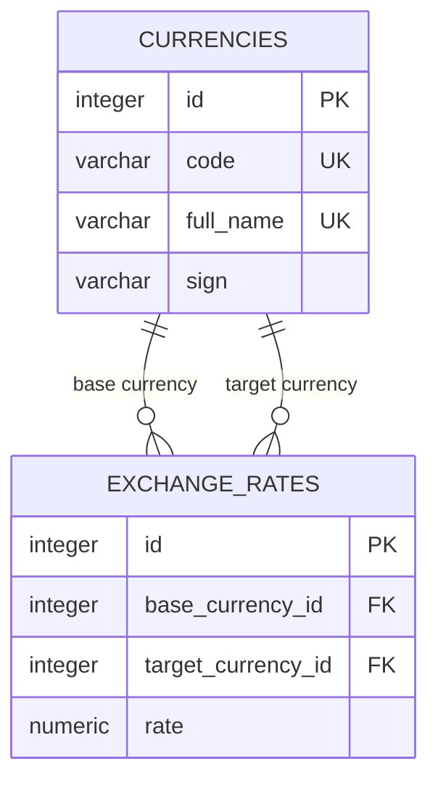

# Currency Exchange

[](https://openjdk.org/projects/jdk/23/)
[](https://jakarta.ee/specifications/servlet/6.1/)
[](https://www.postgresql.org/)
[](https://tomcat.apache.org/)
[](https://maven.apache.org/)

A REST API for managing currencies and exchange rates. The application stores data in PostgreSQL and converts monetary amounts using direct, inverse, or cross rates.

The project is built without Spring or an ORM: the HTTP layer uses Jakarta Servlet API, while persistence is implemented directly with JDBC. This makes the complete request flow—from a servlet to an SQL query and back—explicit and easy to examine.

## ✨ Features

- retrieve all currencies or a single currency by its code;
- add new currencies;
- retrieve and add exchange rates;
- update an existing exchange rate;
- convert an amount between two currencies;
- calculate direct, inverse, and cross rates;
- validate request parameters and decimal values;
- return errors in a consistent JSON format;
- manage a JDBC connection pool throughout the application lifecycle.

## 🛠️ Tech Stack

| Area | Technology |
|---|---|
| Language | Java 23 |
| Web API | Jakarta Servlet 6.1 |
| Application server | Apache Tomcat 11 |
| Database | PostgreSQL |
| Data access | JDBC |
| Connection pool | HikariCP |
| JSON serialization | Jackson |
| Logging | SLF4J + Logback |
| Build | Maven Wrapper |
| Boilerplate reduction | Lombok |

## 🧱 Architecture

| Package | Responsibility |
|---|---|
| `servlet` | receives HTTP requests and writes responses |
| `service` | validates input and implements business logic |
| `dao` | executes SQL queries through JDBC |
| `filter` | converts exceptions into JSON responses with appropriate HTTP statuses |
| `listener` | creates and closes the connection pool with the web application |
| `validator` | validates and parses decimal values |
| `dto` | defines API response models |
| `entity` | represents database records |

### Database schema



The database rejects non-positive rates, pairs containing the same currency, duplicate directed pairs, and simultaneous storage of both directions of the same pair.

## ✅ Prerequisites

- JDK 23;
- Apache Tomcat 11;
- PostgreSQL;
- Git.

You do not need to install Maven separately because the repository includes Maven Wrapper.

## 🚀 Getting Started

### 1. Clone the repository

```bash
git clone https://github.com/RedkinIlyaa/currency-exchange.git
cd currency-exchange
```

### 2. Prepare the database

Create an empty PostgreSQL database:

```bash
createdb -U postgres currency_exchange_db
```

Apply the SQL files in the following order:

```bash
psql -U postgres -d currency_exchange_db -f sql/schema.sql
psql -U postgres -d currency_exchange_db -f sql/insert_currencies.sql
psql -U postgres -d currency_exchange_db -f sql/insert_exchange_rates.sql
```

The seed files are optional, but they make it possible to try the API immediately. Currencies must be inserted before exchange rates.

If `createdb` and `psql` are not available in `PATH`, perform the same steps through pgAdmin.

### 3. Configure the database connection

Create a local configuration file from the provided example.

Linux and macOS:

```bash
cp src/main/resources/application.properties.example \
   src/main/resources/application.properties
```

Windows Command Prompt:

```bat
copy src\main\resources\application.properties.example src\main\resources\application.properties
```

Set the credentials for your PostgreSQL instance:

```properties
db.url=jdbc:postgresql://localhost:5432/currency_exchange_db
db.user=postgres
db.password=your_password
```

The `application.properties` file is excluded from Git, so local database credentials are not committed.

### 4. Build the WAR

Linux and macOS:

```bash
./mvnw clean package
```

Windows:

```bat
mvnw.cmd clean package
```

The generated archive is located at:

```text
target/currency-exchange-1.0-SNAPSHOT.war
```

### 5A. Deploy to Tomcat manually

Copy the WAR to the `webapps` directory of your Tomcat installation. Renaming it to `currency-exchange.war` gives the application the `/currency-exchange` context path.

Linux and macOS:

```bash
cp target/currency-exchange-1.0-SNAPSHOT.war \
   "$CATALINA_HOME/webapps/currency-exchange.war"
```

Windows Command Prompt:

```bat
copy target\currency-exchange-1.0-SNAPSHOT.war "%CATALINA_HOME%\webapps\currency-exchange.war"
```

Start Tomcat. With its default port, the API base URL is:

```text
http://localhost:8080/currency-exchange
```

### 5B. Run with IntelliJ IDEA

1. Open the cloned project in IntelliJ IDEA and wait for Maven import to finish.
2. Open **File → Project Structure → Project** and select JDK 23.
3. Open **Settings → Build, Execution, Deployment → Application Servers**.
4. Add a **Tomcat Server** and select the directory containing your Tomcat 11 installation.
5. Open **Run → Edit Configurations** and add **Tomcat Server → Local**.
6. On the **Deployment** tab, add the `currency-exchange:war exploded` artifact.
7. Set **Application context** to `/`.
8. On the **Server** tab, set the HTTP port to `8081`.
9. Run the configuration.

If your IntelliJ IDEA installation does not provide a **Tomcat Server** run configuration, use the manual deployment instructions above.

With this configuration, the API base URL is:

```text
http://localhost:8081
```

If you choose another port or application context, adjust the URLs below accordingly.

## 📡 API

All responses use the `application/json` media type.

| Method | Endpoint | Description |
|---|---|---|
| `GET` | `/currencies` | retrieve all currencies |
| `GET` | `/currency/{code}` | retrieve a currency by its three-letter code |
| `POST` | `/currencies` | create a currency |
| `GET` | `/exchangeRates` | retrieve all stored exchange rates |
| `GET` | `/exchangeRate/{base}{target}` | retrieve a stored currency-pair rate |
| `POST` | `/exchangeRates` | create an exchange rate |
| `PATCH` | `/exchangeRate/{base}{target}` | update a stored exchange rate |
| `GET` | `/exchange?from={code}&to={code}&amount={value}` | convert an amount |

`POST` and `PATCH` parameters must be sent in the request body with:

```http
Content-Type: application/x-www-form-urlencoded
```

The examples below use the manual deployment URL. Remove `/currency-exchange` when using the IntelliJ IDEA configuration described above.

### Create a currency

```http
POST /currency-exchange/currencies HTTP/1.1
Host: localhost:8080
Content-Type: application/x-www-form-urlencoded

name=Swedish+krona&code=SEK&sign=kr
```

A successful request returns `201 Created`:

```json
{
  "id": 17,
  "name": "Swedish krona",
  "code": "SEK",
  "sign": "kr"
}
```

### Create an exchange rate

```http
POST /currency-exchange/exchangeRates HTTP/1.1
Host: localhost:8080
Content-Type: application/x-www-form-urlencoded

baseCurrencyCode=USD&targetCurrencyCode=SEK&rate=10.5
```

Both directions of a pair are never stored simultaneously. If `USD → RUB` already exists, `RUB → USD` cannot be created because the application can calculate the inverse rate.

### Update an exchange rate

```http
PATCH /currency-exchange/exchangeRate/USDRUB HTTP/1.1
Host: localhost:8080
Content-Type: application/x-www-form-urlencoded

rate=95.25
```

### Convert an amount

```http
GET /currency-exchange/exchange?from=USD&to=RUB&amount=100 HTTP/1.1
Host: localhost:8080
```

Example response:

```json
{
  "baseCurrency": {
    "id": 2,
    "name": "United States dollar",
    "code": "USD",
    "sign": "$"
  },
  "targetCurrency": {
    "id": 4,
    "name": "Russian ruble",
    "code": "RUB",
    "sign": "₽"
  },
  "rate": 95.250000,
  "amount": 100,
  "convertedAmount": 9525.00
}
```

## 🔄 Exchange Rate Calculation

The application resolves a conversion in the following order:

1. Look for a direct `FROM → TO` rate.
2. If it does not exist, look for `TO → FROM` and calculate `1 / rate`.
3. If neither pair exists, look for a route through one common intermediate currency.
4. If several intermediate currencies are available, select the first one alphabetically by currency code.

Routes containing two or more intermediate currencies are not supported.

A rate must contain between 1 and 6 integer digits and up to 6 fractional digits. An amount may contain up to 18 integer digits and up to 6 fractional digits. Both values must be greater than zero, and exponential notation is not accepted.

The converted amount is rounded to two decimal places using `HALF_UP`.

## ⚠️ Error Handling

Errors use a consistent JSON structure:

```json
{
  "message": "Error description"
}
```

| Status | Meaning |
|---|---|
| `400 Bad Request` | missing, malformed, or invalid parameters |
| `404 Not Found` | currency, exchange rate, or endpoint not found |
| `405 Method Not Allowed` | the endpoint does not support the HTTP method |
| `409 Conflict` | currency or exchange rate already exists |
| `500 Internal Server Error` | unexpected server-side failure |

## 🗄️ SQL Scripts

| File | Purpose |
|---|---|
| `sql/schema.sql` | creates tables, constraints, and the unordered-pair unique index |
| `sql/insert_currencies.sql` | inserts demonstration currencies |
| `sql/insert_exchange_rates.sql` | inserts demonstration rates by looking up currencies by code |

## 👤 Author

[Ilya Redkin](https://github.com/RedkinIlyaa)
